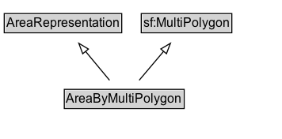

# AreaByMultiPolygon

An area representation encoded as a MultiPolygon geometry.

## Diagram

=== "SVG (interactive)"

    <!-- Generated by graphviz version 14.1.3 (20260303.0454)
     -->
    <!-- Pages: 1 -->
    <svg width="267pt" height="132pt"
     viewBox="0.00 0.00 267.00 132.00" xmlns="http://www.w3.org/2000/svg" xmlns:xlink="http://www.w3.org/1999/xlink">
    <g id="graph0" class="graph" transform="scale(1 1) rotate(0) translate(4 128)">
    <polygon fill="white" stroke="none" points="-4,4 -4,-128 262.62,-128 262.62,4 -4,4"/>
    <g id="clust3" class="cluster">
    <title>cluster_associated</title>
    </g>
    <!-- AreaRepresentation -->
    <g id="node1" class="node">
    <title>AreaRepresentation</title>
    <g id="a_node1"><a xlink:href="../AreaRepresentation" xlink:title="&lt;TABLE&gt;">
    <polygon fill="lightgray" stroke="none" points="1,-97.88 1,-114.12 110.25,-114.12 110.25,-97.88 1,-97.88"/>
    <text xml:space="preserve" text-anchor="start" x="2" y="-101.88" font-family="Arial" font-size="12.00">AreaRepresentation</text>
    <polygon fill="none" stroke="black" points="0,-96.88 0,-115.12 111.25,-115.12 111.25,-96.88 0,-96.88"/>
    </a>
    </g>
    </g>
    <!-- sf_MultiPolygon -->
    <g id="node2" class="node">
    <title>sf_MultiPolygon</title>
    <g id="a_node2"><a xlink:href="https://w3id.org/citydata/imported/sf/latest/MultiPolygon" xlink:title="&lt;TABLE&gt;">
    <polygon fill="lightgray" stroke="none" points="130.75,-97.88 130.75,-114.12 214.5,-114.12 214.5,-97.88 130.75,-97.88"/>
    <text xml:space="preserve" text-anchor="start" x="131.75" y="-101.88" font-family="Arial" font-size="12.00">sf:MultiPolygon</text>
    <polygon fill="none" stroke="black" points="129.75,-96.88 129.75,-115.12 215.5,-115.12 215.5,-96.88 129.75,-96.88"/>
    </a>
    </g>
    </g>
    <!-- AreaByMultiPolygon -->
    <g id="node3" class="node">
    <title>AreaByMultiPolygon</title>
    <g id="a_node3"><a xlink:href="../AreaByMultiPolygon" xlink:title="&lt;TABLE&gt;">
    <polygon fill="lightgray" stroke="none" points="57.88,-25.88 57.88,-42.12 169.38,-42.12 169.38,-25.88 57.88,-25.88"/>
    <text xml:space="preserve" text-anchor="start" x="58.88" y="-29.88" font-family="Arial" font-size="12.00">AreaByMultiPolygon</text>
    <polygon fill="none" stroke="black" points="56.88,-24.88 56.88,-43.12 170.38,-43.12 170.38,-24.88 56.88,-24.88"/>
    </a>
    </g>
    </g>
    <!-- AreaByMultiPolygon&#45;&gt;AreaRepresentation -->
    <g id="edge1" class="edge">
    <title>AreaByMultiPolygon&#45;&gt;AreaRepresentation</title>
    <path fill="none" stroke="black" d="M99.71,-51.79C92.89,-60.02 84.53,-70.11 76.93,-79.29"/>
    <polygon fill="none" stroke="black" points="74.32,-76.96 70.63,-86.89 79.71,-81.42 74.32,-76.96"/>
    </g>
    <!-- AreaByMultiPolygon&#45;&gt;sf_MultiPolygon -->
    <g id="edge2" class="edge">
    <title>AreaByMultiPolygon&#45;&gt;sf_MultiPolygon</title>
    <path fill="none" stroke="black" d="M127.78,-51.79C134.71,-60.02 143.22,-70.11 150.95,-79.29"/>
    <polygon fill="none" stroke="black" points="148.25,-81.51 157.37,-86.9 153.6,-77 148.25,-81.51"/>
    </g>
    <!-- Invis -->
    </g>
    </svg>

=== "PNG"

    

## Formalization for AreaByMultiPolygon

| Property | Constraint |
|----------|------------|
| subClassOf | [AreaRepresentation](AreaRepresentation.md) |
| subClassOf | [sf:MultiPolygon](https://w3id.org/citydata/imported/sf/MultiPolygon) |

