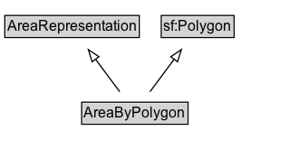

# AreaByPolygon

An area representation encoded as a Polygon geometry.

## Diagram

=== "SVG (interactive)"

    <!-- Generated by graphviz version 14.1.3 (20260303.0454)
     -->
    <!-- Pages: 1 -->
    <svg width="248pt" height="132pt"
     viewBox="0.00 0.00 248.00 132.00" xmlns="http://www.w3.org/2000/svg" xmlns:xlink="http://www.w3.org/1999/xlink">
    <g id="graph0" class="graph" transform="scale(1 1) rotate(0) translate(4 128)">
    <polygon fill="white" stroke="none" points="-4,4 -4,-128 243.62,-128 243.62,4 -4,4"/>
    <g id="clust3" class="cluster">
    <title>cluster_associated</title>
    </g>
    <!-- AreaRepresentation -->
    <g id="node1" class="node">
    <title>AreaRepresentation</title>
    <g id="a_node1"><a xlink:href="../AreaRepresentation" xlink:title="&lt;TABLE&gt;">
    <polygon fill="lightgray" stroke="none" points="1,-97.88 1,-114.12 110.25,-114.12 110.25,-97.88 1,-97.88"/>
    <text xml:space="preserve" text-anchor="start" x="2" y="-101.88" font-family="Arial" font-size="12.00">AreaRepresentation</text>
    <polygon fill="none" stroke="black" points="0,-96.88 0,-115.12 111.25,-115.12 111.25,-96.88 0,-96.88"/>
    </a>
    </g>
    </g>
    <!-- sf_Polygon -->
    <g id="node2" class="node">
    <title>sf_Polygon</title>
    <g id="a_node2"><a xlink:href="https://w3id.org/citydata/imported/sf/latest/Polygon" xlink:title="&lt;TABLE&gt;">
    <polygon fill="lightgray" stroke="none" points="130.5,-97.88 130.5,-114.12 188.75,-114.12 188.75,-97.88 130.5,-97.88"/>
    <text xml:space="preserve" text-anchor="start" x="131.5" y="-101.88" font-family="Arial" font-size="12.00">sf:Polygon</text>
    <polygon fill="none" stroke="black" points="129.5,-96.88 129.5,-115.12 189.75,-115.12 189.75,-96.88 129.5,-96.88"/>
    </a>
    </g>
    </g>
    <!-- AreaByPolygon -->
    <g id="node3" class="node">
    <title>AreaByPolygon</title>
    <g id="a_node3"><a xlink:href="../AreaByPolygon" xlink:title="&lt;TABLE&gt;">
    <polygon fill="lightgray" stroke="none" points="64.62,-25.88 64.62,-42.12 150.62,-42.12 150.62,-25.88 64.62,-25.88"/>
    <text xml:space="preserve" text-anchor="start" x="65.62" y="-29.88" font-family="Arial" font-size="12.00">AreaByPolygon</text>
    <polygon fill="none" stroke="black" points="63.62,-24.88 63.62,-43.12 151.62,-43.12 151.62,-24.88 63.62,-24.88"/>
    </a>
    </g>
    </g>
    <!-- AreaByPolygon&#45;&gt;AreaRepresentation -->
    <g id="edge1" class="edge">
    <title>AreaByPolygon&#45;&gt;AreaRepresentation</title>
    <path fill="none" stroke="black" d="M95.15,-51.79C89.1,-59.93 81.7,-69.9 74.94,-79"/>
    <polygon fill="none" stroke="black" points="72.27,-76.73 69.12,-86.84 77.89,-80.9 72.27,-76.73"/>
    </g>
    <!-- AreaByPolygon&#45;&gt;sf_Polygon -->
    <g id="edge2" class="edge">
    <title>AreaByPolygon&#45;&gt;sf_Polygon</title>
    <path fill="none" stroke="black" d="M120.1,-51.79C126.15,-59.93 133.55,-69.9 140.31,-79"/>
    <polygon fill="none" stroke="black" points="137.36,-80.9 146.13,-86.84 142.98,-76.73 137.36,-80.9"/>
    </g>
    <!-- Invis -->
    </g>
    </svg>

=== "PNG"

    

## Formalization for AreaByPolygon

| Property | Constraint |
|----------|------------|
| subClassOf | [AreaRepresentation](AreaRepresentation.md) |
| subClassOf | [sf:Polygon](https://w3id.org/citydata/imported/sf/Polygon) |

