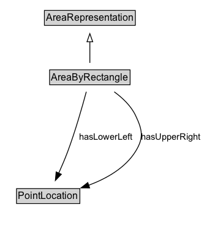

# AreaByRectangle

An area representation encoded as a rectangle, defined by a lower-left corner and an upper-right corner.

## Diagram

=== "SVG (interactive)"

    <!-- Generated by graphviz version 14.1.3 (20260303.0454)
     -->
    <!-- Pages: 1 -->
    <svg width="250pt" height="279pt"
     viewBox="0.00 0.00 250.00 279.00" xmlns="http://www.w3.org/2000/svg" xmlns:xlink="http://www.w3.org/1999/xlink">
    <g id="graph0" class="graph" transform="scale(1 1) rotate(0) translate(4 275)">
    <polygon fill="white" stroke="none" points="-4,4 -4,-275 245.75,-275 245.75,4 -4,4"/>
    <g id="clust3" class="cluster">
    <title>cluster_associated</title>
    </g>
    <!-- AreaRepresentation -->
    <g id="node1" class="node">
    <title>AreaRepresentation</title>
    <g id="a_node1"><a xlink:href="../AreaRepresentation" xlink:title="&lt;TABLE&gt;">
    <polygon fill="lightgray" stroke="none" points="51.38,-244.88 51.38,-261.12 160.62,-261.12 160.62,-244.88 51.38,-244.88"/>
    <text xml:space="preserve" text-anchor="start" x="52.38" y="-248.88" font-family="Arial" font-size="12.00">AreaRepresentation</text>
    <polygon fill="none" stroke="black" points="50.38,-243.88 50.38,-262.12 161.62,-262.12 161.62,-243.88 50.38,-243.88"/>
    </a>
    </g>
    </g>
    <!-- AreaByRectangle -->
    <g id="node2" class="node">
    <title>AreaByRectangle</title>
    <g id="a_node2"><a xlink:href="../AreaByRectangle" xlink:title="&lt;TABLE&gt;">
    <polygon fill="lightgray" stroke="none" points="57.75,-171.88 57.75,-188.12 154.25,-188.12 154.25,-171.88 57.75,-171.88"/>
    <text xml:space="preserve" text-anchor="start" x="58.75" y="-175.88" font-family="Arial" font-size="12.00">AreaByRectangle</text>
    <polygon fill="none" stroke="black" points="56.75,-170.88 56.75,-189.12 155.25,-189.12 155.25,-170.88 56.75,-170.88"/>
    </a>
    </g>
    </g>
    <!-- AreaByRectangle&#45;&gt;AreaRepresentation -->
    <g id="edge1" class="edge">
    <title>AreaByRectangle&#45;&gt;AreaRepresentation</title>
    <path fill="none" stroke="black" d="M106,-197.71C106,-205.47 106,-214.92 106,-223.74"/>
    <polygon fill="none" stroke="black" points="102.5,-223.66 106,-233.66 109.5,-223.66 102.5,-223.66"/>
    </g>
    <!-- Invis -->
    <!-- AreaByRectangle&#45;&gt;Invis -->
    <!-- PointLocation -->
    <g id="node4" class="node">
    <title>PointLocation</title>
    <g id="a_node4"><a xlink:href="../PointLocation" xlink:title="&lt;TABLE&gt;">
    <polygon fill="lightgray" stroke="none" points="17.25,-25.88 17.25,-42.12 92.75,-42.12 92.75,-25.88 17.25,-25.88"/>
    <text xml:space="preserve" text-anchor="start" x="18.25" y="-29.88" font-family="Arial" font-size="12.00">PointLocation</text>
    <polygon fill="none" stroke="black" points="16.25,-24.88 16.25,-43.12 93.75,-43.12 93.75,-24.88 16.25,-24.88"/>
    </a>
    </g>
    </g>
    <!-- AreaByRectangle&#45;&gt;PointLocation -->
    <g id="edge4" class="edge">
    <title>AreaByRectangle&#45;&gt;PointLocation</title>
    <path fill="none" stroke="black" d="M101.65,-162.2C96.76,-143.97 88.3,-114.09 79,-89 75.73,-80.17 71.72,-70.73 67.92,-62.25"/>
    <polygon fill="black" stroke="black" points="71.1,-60.81 63.76,-53.17 64.74,-63.72 71.1,-60.81"/>
    <text xml:space="preserve" text-anchor="middle" x="125.87" y="-103.3" font-family="Arial" font-size="11.00">hasLowerLeft</text>
    </g>
    <!-- AreaByRectangle&#45;&gt;PointLocation -->
    <g id="edge5" class="edge">
    <title>AreaByRectangle&#45;&gt;PointLocation</title>
    <path fill="none" stroke="black" d="M135.87,-162.12C146.12,-154.64 156.41,-144.83 162,-133 170.36,-115.32 172.25,-105.65 162,-89 149.31,-68.38 126.06,-55.35 104.46,-47.27"/>
    <polygon fill="black" stroke="black" points="105.74,-44.01 95.15,-44.08 103.47,-50.63 105.74,-44.01"/>
    <text xml:space="preserve" text-anchor="middle" x="205.37" y="-103.3" font-family="Arial" font-size="11.00">hasUpperRight</text>
    </g>
    <!-- Invis&#45;&gt;PointLocation -->
    </g>
    </svg>

=== "PNG"

    

## Specializations of AreaByRectangle

| Class | Description |
|-------|-------------|
| [Area By Grid](AreaByGrid.md) | An area representation encoded as a grid. The rectangle defined by lower-left and upper-right is the base cell, which is replicated eastward (columns) and northward (rows). |

## Formalization for AreaByRectangle

| Property | Constraint |
|----------|------------|
| [hasLowerLeft](properties/hasLowerLeft.md) | only [PointLocation](https://w3id.org/itsdata/location/v1/PointLocation) |
| [hasUpperRight](properties/hasUpperRight.md) | only [PointLocation](https://w3id.org/itsdata/location/v1/PointLocation) |
| subClassOf | [AreaRepresentation](AreaRepresentation.md) |

