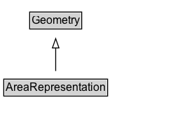

# AreaRepresentation

A geometry/representation that encodes an area location using a specific method.

## Diagram

=== "SVG (interactive)"

    <!-- Generated by graphviz version 14.1.3 (20260303.0454)
     -->
    <!-- Pages: 1 -->
    <svg width="208pt" height="132pt"
     viewBox="0.00 0.00 208.00 132.00" xmlns="http://www.w3.org/2000/svg" xmlns:xlink="http://www.w3.org/1999/xlink">
    <g id="graph0" class="graph" transform="scale(1 1) rotate(0) translate(4 128)">
    <polygon fill="white" stroke="none" points="-4,4 -4,-128 203.62,-128 203.62,4 -4,4"/>
    <g id="clust3" class="cluster">
    <title>cluster_associated</title>
    </g>
    <!-- Geometry -->
    <g id="node1" class="node">
    <title>Geometry</title>
    <g id="a_node1"><a xlink:href="../Geometry" xlink:title="&lt;TABLE&gt;">
    <polygon fill="lightgray" stroke="none" points="28.75,-97.88 28.75,-114.12 82.5,-114.12 82.5,-97.88 28.75,-97.88"/>
    <text xml:space="preserve" text-anchor="start" x="29.75" y="-101.88" font-family="Arial" font-size="12.00">Geometry</text>
    <polygon fill="none" stroke="black" points="27.75,-96.88 27.75,-115.12 83.5,-115.12 83.5,-96.88 27.75,-96.88"/>
    </a>
    </g>
    </g>
    <!-- AreaRepresentation -->
    <g id="node2" class="node">
    <title>AreaRepresentation</title>
    <g id="a_node2"><a xlink:href="../AreaRepresentation" xlink:title="&lt;TABLE&gt;">
    <polygon fill="lightgray" stroke="none" points="1,-25.88 1,-42.12 110.25,-42.12 110.25,-25.88 1,-25.88"/>
    <text xml:space="preserve" text-anchor="start" x="2" y="-29.88" font-family="Arial" font-size="12.00">AreaRepresentation</text>
    <polygon fill="none" stroke="black" points="0,-24.88 0,-43.12 111.25,-43.12 111.25,-24.88 0,-24.88"/>
    </a>
    </g>
    </g>
    <!-- AreaRepresentation&#45;&gt;Geometry -->
    <g id="edge1" class="edge">
    <title>AreaRepresentation&#45;&gt;Geometry</title>
    <path fill="none" stroke="black" d="M55.62,-51.79C55.62,-59.25 55.62,-68.24 55.62,-76.69"/>
    <polygon fill="none" stroke="black" points="52.13,-76.54 55.63,-86.54 59.13,-76.54 52.13,-76.54"/>
    </g>
    <!-- Invis -->
    </g>
    </svg>

=== "PNG"

    

## Specializations of AreaRepresentation

| Class | Description |
|-------|-------------|
| [Area By Circle](AreaByCircle.md) | An area representation encoded as a circle. |
| [Area By Code](AreaByCode.md) | An area representation encoded as a code that references an entry in an external location referencing system. |
| [Area By Grid](AreaByGrid.md) | An area representation encoded as a grid. The rectangle defined by lower-left and upper-right is the base cell, which is replicated eastward (columns) and northward (rows). |
| [Area By Grid](AreaByGrid.md) | An area representation encoded as a grid. The rectangle defined by lower-left and upper-right is the base cell, which is replicated eastward (columns) and northward (rows). |
| [Area By Linear Boundaries](AreaByLinearBoundaries.md) | An area representation encoded as a set of linear boundary representations. |
| [Area By Multi Polygon](AreaByMultiPolygon.md) | An area representation encoded as a MultiPolygon geometry. |
| [Area By Polygon](AreaByPolygon.md) | An area representation encoded as a Polygon geometry. |
| [Area By Rectangle](AreaByRectangle.md) | An area representation encoded as a rectangle, defined by a lower-left corner and an upper-right corner. |

## Formalization for AreaRepresentation

| Property | Constraint |
|----------|------------|
| subClassOf | [Geometry](Geometry.md) |

