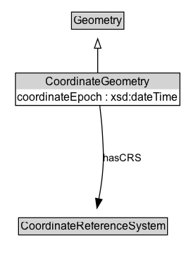

# CoordinateGeometry

A geometry that is represented by a coordinate system (i.e., directly encodes coordinate tuples).

## Diagram

=== "SVG (interactive)"

    <!-- Generated by graphviz version 14.1.3 (20260303.0454)
     -->
    <!-- Pages: 1 -->
    <svg width="198pt" height="279pt"
     viewBox="0.00 0.00 198.00 279.00" xmlns="http://www.w3.org/2000/svg" xmlns:xlink="http://www.w3.org/1999/xlink">
    <g id="graph0" class="graph" transform="scale(1 1) rotate(0) translate(4 275)">
    <polygon fill="white" stroke="none" points="-4,4 -4,-275 194,-275 194,4 -4,4"/>
    <g id="clust3" class="cluster">
    <title>cluster_associated</title>
    </g>
    <!-- Geometry -->
    <g id="node1" class="node">
    <title>Geometry</title>
    <g id="a_node1"><a xlink:href="../Geometry" xlink:title="&lt;TABLE&gt;">
    <polygon fill="lightgray" stroke="none" points="73.12,-244.88 73.12,-261.12 126.88,-261.12 126.88,-244.88 73.12,-244.88"/>
    <text xml:space="preserve" text-anchor="start" x="74.12" y="-248.88" font-family="Arial" font-size="12.00">Geometry</text>
    <polygon fill="none" stroke="black" points="72.12,-243.88 72.12,-262.12 127.88,-262.12 127.88,-243.88 72.12,-243.88"/>
    </a>
    </g>
    </g>
    <!-- CoordinateGeometry -->
    <g id="node2" class="node">
    <title>CoordinateGeometry</title>
    <g id="a_node2"><a xlink:href="../CoordinateGeometry" xlink:title="&lt;TABLE&gt;">
    <polygon fill="lightgray" stroke="none" points="13.5,-180 13.5,-196.25 186.5,-196.25 186.5,-180 13.5,-180"/>
    <text xml:space="preserve" text-anchor="start" x="44.5" y="-184" font-family="Arial" font-size="12.00">CoordinateGeometry</text>
    <text xml:space="preserve" text-anchor="start" x="14.5" y="-167.75" font-family="Arial" font-size="12.00">coordinateEpoch : xsd:dateTime</text>
    <polygon fill="none" stroke="black" points="12.5,-162.75 12.5,-197.25 187.5,-197.25 187.5,-162.75 12.5,-162.75"/>
    </a>
    </g>
    </g>
    <!-- CoordinateGeometry&#45;&gt;Geometry -->
    <g id="edge1" class="edge">
    <title>CoordinateGeometry&#45;&gt;Geometry</title>
    <path fill="none" stroke="black" d="M100,-197.71C100,-205.47 100,-214.92 100,-223.74"/>
    <polygon fill="none" stroke="black" points="96.5,-223.66 100,-233.66 103.5,-223.66 96.5,-223.66"/>
    </g>
    <!-- Invis -->
    <!-- CoordinateGeometry&#45;&gt;Invis -->
    <!-- CoordinateReferenceSystem -->
    <g id="node4" class="node">
    <title>CoordinateReferenceSystem</title>
    <g id="a_node4"><a xlink:href="../CoordinateReferenceSystem" xlink:title="&lt;TABLE&gt;">
    <polygon fill="lightgray" stroke="none" points="16.75,-25.88 16.75,-42.12 173.25,-42.12 173.25,-25.88 16.75,-25.88"/>
    <text xml:space="preserve" text-anchor="start" x="17.75" y="-29.88" font-family="Arial" font-size="12.00">CoordinateReferenceSystem</text>
    <polygon fill="none" stroke="black" points="15.75,-24.88 15.75,-43.12 174.25,-43.12 174.25,-24.88 15.75,-24.88"/>
    </a>
    </g>
    </g>
    <!-- CoordinateGeometry&#45;&gt;CoordinateReferenceSystem -->
    <g id="edge4" class="edge">
    <title>CoordinateGeometry&#45;&gt;CoordinateReferenceSystem</title>
    <path fill="none" stroke="black" d="M102.24,-162.43C103.31,-153.69 104.47,-142.79 105,-133 106.06,-113.47 106.79,-108.47 105,-89 104.22,-80.48 102.76,-71.3 101.19,-62.97"/>
    <polygon fill="black" stroke="black" points="104.66,-62.51 99.26,-53.4 97.8,-63.89 104.66,-62.51"/>
    <text xml:space="preserve" text-anchor="middle" x="126.71" y="-103.3" font-family="Arial" font-size="11.00">hasCRS</text>
    </g>
    <!-- Invis&#45;&gt;CoordinateReferenceSystem -->
    </g>
    </svg>

=== "PNG"

    

## Specializations of CoordinateGeometry

| Class | Description |
|-------|-------------|
| [Point By Coordinates](PointByCoordinates.md) | A point location representation encoded as coordinates and optional elements, such as elevation and metadata. |
| [Point By Geo Coordinates](PointByGeoCoordinates.md) | A point location representation encoded as latitude/longitude and optional elements, such as elevation and metadata. |
| [Point By Projected Coordinates](PointByProjectedCoordinates.md) | A point location representation encoded as projected coordinates and optional elements, such as elevation and metadata. |

## Formalization for CoordinateGeometry

| Property | Constraint |
|----------|------------|
| [coordinateEpoch](properties/coordinateEpoch.md) | datatype xsd:dateTime |
| [hasCRS](properties/hasCRS.md) | only [CoordinateReferenceSystem](https://w3id.org/itsdata/location/v1/CoordinateReferenceSystem) |
| subClassOf | [Geometry](Geometry.md) |

