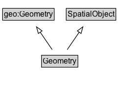

# Geometry

An ITS-domain geometry (subclass of geo:Geometry) used to model geometric representations of features.

## Diagram

=== "SVG (interactive)"

    <!-- Generated by graphviz version 14.1.3 (20260303.0454)
     -->
    <!-- Pages: 1 -->
    <svg width="212pt" height="132pt"
     viewBox="0.00 0.00 212.00 132.00" xmlns="http://www.w3.org/2000/svg" xmlns:xlink="http://www.w3.org/1999/xlink">
    <g id="graph0" class="graph" transform="scale(1 1) rotate(0) translate(4 128)">
    <polygon fill="white" stroke="none" points="-4,4 -4,-128 207.5,-128 207.5,4 -4,4"/>
    <g id="clust3" class="cluster">
    <title>cluster_associated</title>
    </g>
    <!-- geo_Geometry -->
    <g id="node1" class="node">
    <title>geo_Geometry</title>
    <g id="a_node1"><a xlink:href="https://w3id.org/citydata/imported/geo/latest/Geometry" xlink:title="&lt;TABLE&gt;">
    <polygon fill="lightgray" stroke="none" points="1,-97.88 1,-114.12 78,-114.12 78,-97.88 1,-97.88"/>
    <text xml:space="preserve" text-anchor="start" x="2" y="-101.88" font-family="Arial" font-size="12.00">geo:Geometry</text>
    <polygon fill="none" stroke="black" points="0,-96.88 0,-115.12 79,-115.12 79,-96.88 0,-96.88"/>
    </a>
    </g>
    </g>
    <!-- SpatialObject -->
    <g id="node2" class="node">
    <title>SpatialObject</title>
    <g id="a_node2"><a xlink:href="../SpatialObject" xlink:title="&lt;TABLE&gt;">
    <polygon fill="lightgray" stroke="none" points="98.5,-97.88 98.5,-114.12 172.5,-114.12 172.5,-97.88 98.5,-97.88"/>
    <text xml:space="preserve" text-anchor="start" x="99.5" y="-101.88" font-family="Arial" font-size="12.00">SpatialObject</text>
    <polygon fill="none" stroke="black" points="97.5,-96.88 97.5,-115.12 173.5,-115.12 173.5,-96.88 97.5,-96.88"/>
    </a>
    </g>
    </g>
    <!-- Geometry -->
    <g id="node3" class="node">
    <title>Geometry</title>
    <g id="a_node3"><a xlink:href="../Geometry" xlink:title="&lt;TABLE&gt;">
    <polygon fill="lightgray" stroke="none" points="60.62,-25.88 60.62,-42.12 114.38,-42.12 114.38,-25.88 60.62,-25.88"/>
    <text xml:space="preserve" text-anchor="start" x="61.62" y="-29.88" font-family="Arial" font-size="12.00">Geometry</text>
    <polygon fill="none" stroke="black" points="59.62,-24.88 59.62,-43.12 115.38,-43.12 115.38,-24.88 59.62,-24.88"/>
    </a>
    </g>
    </g>
    <!-- Geometry&#45;&gt;geo_Geometry -->
    <g id="edge1" class="edge">
    <title>Geometry&#45;&gt;geo_Geometry</title>
    <path fill="none" stroke="black" d="M75.99,-51.79C70.46,-59.85 63.71,-69.69 57.52,-78.71"/>
    <polygon fill="none" stroke="black" points="54.74,-76.58 51.98,-86.81 60.52,-80.54 54.74,-76.58"/>
    </g>
    <!-- Geometry&#45;&gt;SpatialObject -->
    <g id="edge2" class="edge">
    <title>Geometry&#45;&gt;SpatialObject</title>
    <path fill="none" stroke="black" d="M99.01,-51.79C104.54,-59.85 111.29,-69.69 117.48,-78.71"/>
    <polygon fill="none" stroke="black" points="114.48,-80.54 123.02,-86.81 120.26,-76.58 114.48,-80.54"/>
    </g>
    <!-- Invis -->
    </g>
    </svg>

=== "PNG"

    

## Specializations of Geometry

| Class | Description |
|-------|-------------|
| [Area By Circle](AreaByCircle.md) | An area representation encoded as a circle. |
| [Area By Code](AreaByCode.md) | An area representation encoded as a code that references an entry in an external location referencing system. |
| [Area By Grid](AreaByGrid.md) | An area representation encoded as a grid. The rectangle defined by lower-left and upper-right is the base cell, which is replicated eastward (columns) and northward (rows). |
| [Area By Grid](AreaByGrid.md) | An area representation encoded as a grid. The rectangle defined by lower-left and upper-right is the base cell, which is replicated eastward (columns) and northward (rows). |
| [Area By Linear Boundaries](AreaByLinearBoundaries.md) | An area representation encoded as a set of linear boundary representations. |
| [Area By Multi Polygon](AreaByMultiPolygon.md) | An area representation encoded as a MultiPolygon geometry. |
| [Area By Polygon](AreaByPolygon.md) | An area representation encoded as a Polygon geometry. |
| [Area By Rectangle](AreaByRectangle.md) | An area representation encoded as a rectangle, defined by a lower-left corner and an upper-right corner. |
| [Area Representation](AreaRepresentation.md) | A geometry/representation that encodes an area location using a specific method. |
| [Coordinate Geometry](CoordinateGeometry.md) | A geometry that is represented by a coordinate system (i.e., directly encodes coordinate tuples). |
| [Itinerary By Waypoints](ItineraryByWaypoints.md) | An itinerary representation encoded as an ordered sequence of locations (waypoints). |
| [Itinerary Code](ItineraryCode.md) | An itinerary representation encoded as a code that references an entry in an external itinerary/route referencing system. |
| [Itinerary Representation](ItineraryRepresentation.md) | A geometry/representation that encodes an itinerary using a specific method. |
| [Linear By Code](LinearByCode.md) | A linear representation encoded as a code that references an entry in an external location referencing system. |
| [Linear By Linear Ring](LinearByLinearRing.md) | A linear representation encoded as a LinearRing geometry. |
| [Linear By Line String](LinearByLineString.md) | A linear representation encoded as a LineString geometry. |
| [Linear By Multi Line String](LinearByMultiLineString.md) | A linear representation encoded as a MultiLineString geometry. |
| [Linear By Point Representations](LinearByPointRepresentations.md) | A linear representation encoded as an ordered sequence of point representations. |
| [Linear By Points](LinearByPoints.md) | A linear representation encoded as an ordered sequence of points. |
| [Linear Representation](LinearRepresentation.md) | A geometry/representation that encodes a linear location using a specific method. |
| [Point By Code](PointByCode.md) | A point location representation using a code that references an entry in an external location referencing system. |
| [Point By Coordinates](PointByCoordinates.md) | A point location representation encoded as coordinates and optional elements, such as elevation and metadata. |
| [Point By Coordinates](PointByCoordinates.md) | A point location representation encoded as coordinates and optional elements, such as elevation and metadata. |
| [Point By Geo Coordinates](PointByGeoCoordinates.md) | A point location representation encoded as latitude/longitude and optional elements, such as elevation and metadata. |
| [Point By Linear Position](PointByLinearPosition.md) | A point representation defined by an offset along a linear representation. |
| [Point By Projected Coordinates](PointByProjectedCoordinates.md) | A point location representation encoded as projected coordinates and optional elements, such as elevation and metadata. |
| [Point Representation](PointRepresentation.md) | A representation of a point location using a specific method (e.g., coordinates or an external code). |

## Formalization for Geometry

| Property | Constraint |
|----------|------------|
| subClassOf | [SpatialObject](SpatialObject.md) |
| subClassOf | [geo:Geometry](https://w3id.org/citydata/imported/geo/Geometry) |

