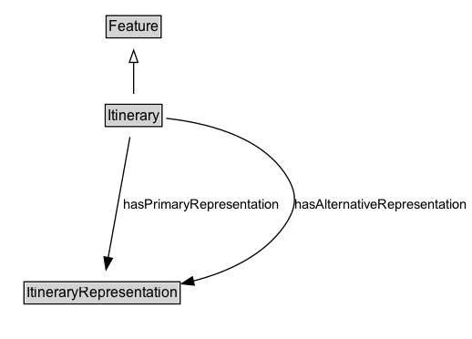

# Itinerary

An ordered set of multiple physically separate locations forming a route or itinerary.

## Diagram

=== "SVG (interactive)"

    <!-- Generated by graphviz version 14.1.3 (20260303.0454)
     -->
    <!-- Pages: 1 -->
    <svg width="388pt" height="279pt"
     viewBox="0.00 0.00 388.00 279.00" xmlns="http://www.w3.org/2000/svg" xmlns:xlink="http://www.w3.org/1999/xlink">
    <g id="graph0" class="graph" transform="scale(1 1) rotate(0) translate(4 275)">
    <polygon fill="white" stroke="none" points="-4,4 -4,-275 384.15,-275 384.15,4 -4,4"/>
    <g id="clust3" class="cluster">
    <title>cluster_associated</title>
    </g>
    <!-- Feature -->
    <g id="node1" class="node">
    <title>Feature</title>
    <g id="a_node1"><a xlink:href="../Feature" xlink:title="&lt;TABLE&gt;">
    <polygon fill="lightgray" stroke="none" points="84.38,-244.88 84.38,-261.12 127.62,-261.12 127.62,-244.88 84.38,-244.88"/>
    <text xml:space="preserve" text-anchor="start" x="85.38" y="-248.88" font-family="Arial" font-size="12.00">Feature</text>
    <polygon fill="none" stroke="black" points="83.38,-243.88 83.38,-262.12 128.62,-262.12 128.62,-243.88 83.38,-243.88"/>
    </a>
    </g>
    </g>
    <!-- Itinerary -->
    <g id="node2" class="node">
    <title>Itinerary</title>
    <g id="a_node2"><a xlink:href="../Itinerary" xlink:title="&lt;TABLE&gt;">
    <polygon fill="lightgray" stroke="none" points="83.62,-171.88 83.62,-188.12 128.38,-188.12 128.38,-171.88 83.62,-171.88"/>
    <text xml:space="preserve" text-anchor="start" x="84.62" y="-175.88" font-family="Arial" font-size="12.00">Itinerary</text>
    <polygon fill="none" stroke="black" points="82.62,-170.88 82.62,-189.12 129.38,-189.12 129.38,-170.88 82.62,-170.88"/>
    </a>
    </g>
    </g>
    <!-- Itinerary&#45;&gt;Feature -->
    <g id="edge1" class="edge">
    <title>Itinerary&#45;&gt;Feature</title>
    <path fill="none" stroke="black" d="M106,-197.71C106,-205.47 106,-214.92 106,-223.74"/>
    <polygon fill="none" stroke="black" points="102.5,-223.66 106,-233.66 109.5,-223.66 102.5,-223.66"/>
    </g>
    <!-- Invis -->
    <!-- Itinerary&#45;&gt;Invis -->
    <!-- ItineraryRepresentation -->
    <g id="node4" class="node">
    <title>ItineraryRepresentation</title>
    <g id="a_node4"><a xlink:href="../ItineraryRepresentation" xlink:title="&lt;TABLE&gt;">
    <polygon fill="lightgray" stroke="none" points="16.75,-25.88 16.75,-42.12 143.25,-42.12 143.25,-25.88 16.75,-25.88"/>
    <text xml:space="preserve" text-anchor="start" x="17.75" y="-29.88" font-family="Arial" font-size="12.00">ItineraryRepresentation</text>
    <polygon fill="none" stroke="black" points="15.75,-24.88 15.75,-43.12 144.25,-43.12 144.25,-24.88 15.75,-24.88"/>
    </a>
    </g>
    </g>
    <!-- Itinerary&#45;&gt;ItineraryRepresentation -->
    <g id="edge4" class="edge">
    <title>Itinerary&#45;&gt;ItineraryRepresentation</title>
    <path fill="none" stroke="black" d="M102.97,-162.2C98.56,-137.81 90.35,-92.31 85.03,-62.86"/>
    <polygon fill="black" stroke="black" points="88.5,-62.4 83.28,-53.18 81.62,-63.65 88.5,-62.4"/>
    <text xml:space="preserve" text-anchor="middle" x="161.8" y="-103.3" font-family="Arial" font-size="11.00">hasPrimaryRepresentation</text>
    </g>
    <!-- Itinerary&#45;&gt;ItineraryRepresentation -->
    <g id="edge5" class="edge">
    <title>Itinerary&#45;&gt;ItineraryRepresentation</title>
    <path fill="none" stroke="black" d="M132.87,-177.57C162.28,-174.4 208.17,-164.38 230,-133 241.17,-116.95 241.24,-105 230,-89 212.79,-64.51 183.35,-51.08 155.09,-43.73"/>
    <polygon fill="black" stroke="black" points="155.93,-40.33 145.4,-41.45 154.34,-47.14 155.93,-40.33"/>
    <text xml:space="preserve" text-anchor="middle" x="309.28" y="-103.3" font-family="Arial" font-size="11.00">hasAlternativeRepresentation</text>
    </g>
    <!-- Invis&#45;&gt;ItineraryRepresentation -->
    </g>
    </svg>

=== "PNG"

    

## Formalization for Itinerary

| Property | Constraint |
|----------|------------|
| [hasAlternativeRepresentation](properties/hasAlternativeRepresentation.md) | only [ItineraryRepresentation](https://w3id.org/itsdata/location/v1/ItineraryRepresentation) |
| [hasPrimaryRepresentation](properties/hasPrimaryRepresentation.md) | only [ItineraryRepresentation](https://w3id.org/itsdata/location/v1/ItineraryRepresentation) |
| subClassOf | [Feature](Feature.md) |

