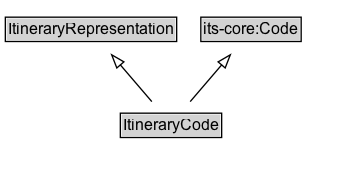

# ItineraryCode

An itinerary representation encoded as a code that references an entry in an external itinerary/route referencing system.

## Diagram

=== "SVG (interactive)"

    <!-- Generated by graphviz version 14.1.3 (20260303.0454)
     -->
    <!-- Pages: 1 -->
    <svg width="258pt" height="132pt"
     viewBox="0.00 0.00 258.00 132.00" xmlns="http://www.w3.org/2000/svg" xmlns:xlink="http://www.w3.org/1999/xlink">
    <g id="graph0" class="graph" transform="scale(1 1) rotate(0) translate(4 128)">
    <polygon fill="white" stroke="none" points="-4,4 -4,-128 254.25,-128 254.25,4 -4,4"/>
    <g id="clust3" class="cluster">
    <title>cluster_associated</title>
    </g>
    <!-- ItineraryRepresentation -->
    <g id="node1" class="node">
    <title>ItineraryRepresentation</title>
    <g id="a_node1"><a xlink:href="../ItineraryRepresentation" xlink:title="&lt;TABLE&gt;">
    <polygon fill="lightgray" stroke="none" points="1,-97.88 1,-114.12 127.5,-114.12 127.5,-97.88 1,-97.88"/>
    <text xml:space="preserve" text-anchor="start" x="2" y="-101.88" font-family="Arial" font-size="12.00">ItineraryRepresentation</text>
    <polygon fill="none" stroke="black" points="0,-96.88 0,-115.12 128.5,-115.12 128.5,-96.88 0,-96.88"/>
    </a>
    </g>
    </g>
    <!-- its&#45;core_Code -->
    <g id="node2" class="node">
    <title>its&#45;core_Code</title>
    <g id="a_node2"><a xlink:href="https://w3id.org/itsdata/core/v1/Code" xlink:title="&lt;TABLE&gt;">
    <polygon fill="lightgray" stroke="none" points="147.62,-97.88 147.62,-114.12 220.88,-114.12 220.88,-97.88 147.62,-97.88"/>
    <text xml:space="preserve" text-anchor="start" x="148.62" y="-101.88" font-family="Arial" font-size="12.00">its&#45;core:Code</text>
    <polygon fill="none" stroke="black" points="146.62,-96.88 146.62,-115.12 221.88,-115.12 221.88,-96.88 146.62,-96.88"/>
    </a>
    </g>
    </g>
    <!-- ItineraryCode -->
    <g id="node3" class="node">
    <title>ItineraryCode</title>
    <g id="a_node3"><a xlink:href="../ItineraryCode" xlink:title="&lt;TABLE&gt;">
    <polygon fill="lightgray" stroke="none" points="87.25,-25.88 87.25,-42.12 161.25,-42.12 161.25,-25.88 87.25,-25.88"/>
    <text xml:space="preserve" text-anchor="start" x="88.25" y="-29.88" font-family="Arial" font-size="12.00">ItineraryCode</text>
    <polygon fill="none" stroke="black" points="86.25,-24.88 86.25,-43.12 162.25,-43.12 162.25,-24.88 86.25,-24.88"/>
    </a>
    </g>
    </g>
    <!-- ItineraryCode&#45;&gt;ItineraryRepresentation -->
    <g id="edge1" class="edge">
    <title>ItineraryCode&#45;&gt;ItineraryRepresentation</title>
    <path fill="none" stroke="black" d="M109.86,-51.79C102.73,-60.11 93.97,-70.32 86.04,-79.58"/>
    <polygon fill="none" stroke="black" points="83.61,-77.04 79.76,-86.91 88.92,-81.59 83.61,-77.04"/>
    </g>
    <!-- ItineraryCode&#45;&gt;its&#45;core_Code -->
    <g id="edge2" class="edge">
    <title>ItineraryCode&#45;&gt;its&#45;core_Code</title>
    <path fill="none" stroke="black" d="M138.64,-51.79C145.77,-60.11 154.53,-70.32 162.46,-79.58"/>
    <polygon fill="none" stroke="black" points="159.58,-81.59 168.74,-86.91 164.89,-77.04 159.58,-81.59"/>
    </g>
    <!-- Invis -->
    </g>
    </svg>

=== "PNG"

    

## Formalization for ItineraryCode

| Property | Constraint |
|----------|------------|
| subClassOf | [ItineraryRepresentation](ItineraryRepresentation.md) |
| subClassOf | [its-core:Code](https://w3id.org/itsdata/core/v1/Code) |

