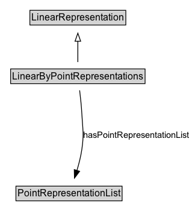

# LinearByPointRepresentations

A linear representation encoded as an ordered sequence of point representations.

## Diagram

=== "SVG (interactive)"

    <!-- Generated by graphviz version 14.1.3 (20260303.0454)
     -->
    <!-- Pages: 1 -->
    <svg width="240pt" height="279pt"
     viewBox="0.00 0.00 240.00 279.00" xmlns="http://www.w3.org/2000/svg" xmlns:xlink="http://www.w3.org/1999/xlink">
    <g id="graph0" class="graph" transform="scale(1 1) rotate(0) translate(4 275)">
    <polygon fill="white" stroke="none" points="-4,4 -4,-275 235.52,-275 235.52,4 -4,4"/>
    <g id="clust3" class="cluster">
    <title>cluster_associated</title>
    </g>
    <!-- LinearRepresentation -->
    <g id="node1" class="node">
    <title>LinearRepresentation</title>
    <g id="a_node1"><a xlink:href="../LinearRepresentation" xlink:title="&lt;TABLE&gt;">
    <polygon fill="lightgray" stroke="none" points="34.25,-244.88 34.25,-261.12 151.75,-261.12 151.75,-244.88 34.25,-244.88"/>
    <text xml:space="preserve" text-anchor="start" x="35.25" y="-248.88" font-family="Arial" font-size="12.00">LinearRepresentation</text>
    <polygon fill="none" stroke="black" points="33.25,-243.88 33.25,-262.12 152.75,-262.12 152.75,-243.88 33.25,-243.88"/>
    </a>
    </g>
    </g>
    <!-- LinearByPointRepresentations -->
    <g id="node2" class="node">
    <title>LinearByPointRepresentations</title>
    <g id="a_node2"><a xlink:href="../LinearByPointRepresentations" xlink:title="&lt;TABLE&gt;">
    <polygon fill="lightgray" stroke="none" points="10.25,-171.88 10.25,-188.12 175.75,-188.12 175.75,-171.88 10.25,-171.88"/>
    <text xml:space="preserve" text-anchor="start" x="11.25" y="-175.88" font-family="Arial" font-size="12.00">LinearByPointRepresentations</text>
    <polygon fill="none" stroke="black" points="9.25,-170.88 9.25,-189.12 176.75,-189.12 176.75,-170.88 9.25,-170.88"/>
    </a>
    </g>
    </g>
    <!-- LinearByPointRepresentations&#45;&gt;LinearRepresentation -->
    <g id="edge1" class="edge">
    <title>LinearByPointRepresentations&#45;&gt;LinearRepresentation</title>
    <path fill="none" stroke="black" d="M93,-197.71C93,-205.47 93,-214.92 93,-223.74"/>
    <polygon fill="none" stroke="black" points="89.5,-223.66 93,-233.66 96.5,-223.66 89.5,-223.66"/>
    </g>
    <!-- Invis -->
    <!-- LinearByPointRepresentations&#45;&gt;Invis -->
    <!-- PointRepresentationList -->
    <g id="node4" class="node">
    <title>PointRepresentationList</title>
    <g id="a_node4"><a xlink:href="../PointRepresentationList" xlink:title="&lt;TABLE&gt;">
    <polygon fill="lightgray" stroke="none" points="16.88,-25.88 16.88,-42.12 147.12,-42.12 147.12,-25.88 16.88,-25.88"/>
    <text xml:space="preserve" text-anchor="start" x="17.88" y="-29.88" font-family="Arial" font-size="12.00">PointRepresentationList</text>
    <polygon fill="none" stroke="black" points="15.88,-24.88 15.88,-43.12 148.12,-43.12 148.12,-24.88 15.88,-24.88"/>
    </a>
    </g>
    </g>
    <!-- LinearByPointRepresentations&#45;&gt;PointRepresentationList -->
    <g id="edge4" class="edge">
    <title>LinearByPointRepresentations&#45;&gt;PointRepresentationList</title>
    <path fill="none" stroke="black" d="M95.24,-162.43C96.31,-153.69 97.47,-142.79 98,-133 99.06,-113.47 100.81,-108.35 98,-89 96.73,-80.22 94.35,-70.88 91.8,-62.48"/>
    <polygon fill="black" stroke="black" points="95.2,-61.62 88.79,-53.18 88.54,-63.78 95.2,-61.62"/>
    <text xml:space="preserve" text-anchor="middle" x="165.52" y="-103.3" font-family="Arial" font-size="11.00">hasPointRepresentationList</text>
    </g>
    <!-- Invis&#45;&gt;PointRepresentationList -->
    </g>
    </svg>

=== "PNG"

    

## Formalization for LinearByPointRepresentations

| Property | Constraint |
|----------|------------|
| [hasPointRepresentationList](properties/hasPointRepresentationList.md) | only [PointRepresentationList](https://w3id.org/itsdata/location/v1/PointRepresentationList) |
| subClassOf | [LinearRepresentation](LinearRepresentation.md) |

