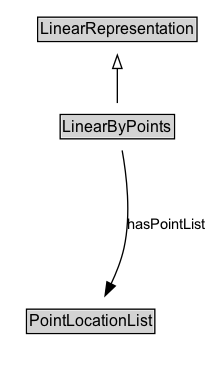

# LinearByPoints

A linear representation encoded as an ordered sequence of points.

## Diagram

=== "SVG (interactive)"

    <!-- Generated by graphviz version 14.1.3 (20260303.0454)
     -->
    <!-- Pages: 1 -->
    <svg width="158pt" height="279pt"
     viewBox="0.00 0.00 158.00 279.00" xmlns="http://www.w3.org/2000/svg" xmlns:xlink="http://www.w3.org/1999/xlink">
    <g id="graph0" class="graph" transform="scale(1 1) rotate(0) translate(4 275)">
    <polygon fill="white" stroke="none" points="-4,4 -4,-275 154.36,-275 154.36,4 -4,4"/>
    <g id="clust3" class="cluster">
    <title>cluster_associated</title>
    </g>
    <!-- LinearRepresentation -->
    <g id="node1" class="node">
    <title>LinearRepresentation</title>
    <g id="a_node1"><a xlink:href="../LinearRepresentation" xlink:title="&lt;TABLE&gt;">
    <polygon fill="lightgray" stroke="none" points="25.25,-244.88 25.25,-261.12 142.75,-261.12 142.75,-244.88 25.25,-244.88"/>
    <text xml:space="preserve" text-anchor="start" x="26.25" y="-248.88" font-family="Arial" font-size="12.00">LinearRepresentation</text>
    <polygon fill="none" stroke="black" points="24.25,-243.88 24.25,-262.12 143.75,-262.12 143.75,-243.88 24.25,-243.88"/>
    </a>
    </g>
    </g>
    <!-- LinearByPoints -->
    <g id="node2" class="node">
    <title>LinearByPoints</title>
    <g id="a_node2"><a xlink:href="../LinearByPoints" xlink:title="&lt;TABLE&gt;">
    <polygon fill="lightgray" stroke="none" points="42.12,-171.88 42.12,-188.12 125.88,-188.12 125.88,-171.88 42.12,-171.88"/>
    <text xml:space="preserve" text-anchor="start" x="43.12" y="-175.88" font-family="Arial" font-size="12.00">LinearByPoints</text>
    <polygon fill="none" stroke="black" points="41.12,-170.88 41.12,-189.12 126.88,-189.12 126.88,-170.88 41.12,-170.88"/>
    </a>
    </g>
    </g>
    <!-- LinearByPoints&#45;&gt;LinearRepresentation -->
    <g id="edge1" class="edge">
    <title>LinearByPoints&#45;&gt;LinearRepresentation</title>
    <path fill="none" stroke="black" d="M84,-197.71C84,-205.47 84,-214.92 84,-223.74"/>
    <polygon fill="none" stroke="black" points="80.5,-223.66 84,-233.66 87.5,-223.66 80.5,-223.66"/>
    </g>
    <!-- Invis -->
    <!-- LinearByPoints&#45;&gt;Invis -->
    <!-- PointLocationList -->
    <g id="node4" class="node">
    <title>PointLocationList</title>
    <g id="a_node4"><a xlink:href="../PointLocationList" xlink:title="&lt;TABLE&gt;">
    <polygon fill="lightgray" stroke="none" points="16.88,-25.88 16.88,-42.12 111.12,-42.12 111.12,-25.88 16.88,-25.88"/>
    <text xml:space="preserve" text-anchor="start" x="17.88" y="-29.88" font-family="Arial" font-size="12.00">PointLocationList</text>
    <polygon fill="none" stroke="black" points="15.88,-24.88 15.88,-43.12 112.12,-43.12 112.12,-24.88 15.88,-24.88"/>
    </a>
    </g>
    </g>
    <!-- LinearByPoints&#45;&gt;PointLocationList -->
    <g id="edge4" class="edge">
    <title>LinearByPoints&#45;&gt;PointLocationList</title>
    <path fill="none" stroke="black" d="M87.61,-162.19C90.92,-143.95 94.52,-114.06 89,-89 86.97,-79.78 83.2,-70.26 79.2,-61.83"/>
    <polygon fill="black" stroke="black" points="82.45,-60.51 74.79,-53.18 76.21,-63.68 82.45,-60.51"/>
    <text xml:space="preserve" text-anchor="middle" x="121.11" y="-103.3" font-family="Arial" font-size="11.00">hasPointList</text>
    </g>
    <!-- Invis&#45;&gt;PointLocationList -->
    </g>
    </svg>

=== "PNG"

    

## Formalization for LinearByPoints

| Property | Constraint |
|----------|------------|
| [hasPointList](properties/hasPointList.md) | only [PointLocationList](https://w3id.org/itsdata/location/v1/PointLocationList) |
| subClassOf | [LinearRepresentation](LinearRepresentation.md) |

