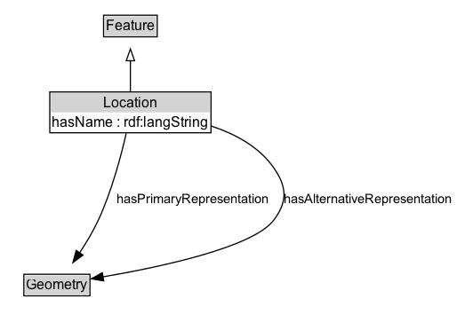

# Location

A singular location modelled as a feature.

## Diagram

=== "SVG (interactive)"

    <!-- Generated by graphviz version 14.1.3 (20260303.0454)
     -->
    <!-- Pages: 1 -->
    <svg width="385pt" height="279pt"
     viewBox="0.00 0.00 385.00 279.00" xmlns="http://www.w3.org/2000/svg" xmlns:xlink="http://www.w3.org/1999/xlink">
    <g id="graph0" class="graph" transform="scale(1 1) rotate(0) translate(4 275)">
    <polygon fill="white" stroke="none" points="-4,4 -4,-275 381.3,-275 381.3,4 -4,4"/>
    <g id="clust3" class="cluster">
    <title>cluster_associated</title>
    </g>
    <!-- Feature -->
    <g id="node1" class="node">
    <title>Feature</title>
    <g id="a_node1"><a xlink:href="../Feature" xlink:title="&lt;TABLE&gt;">
    <polygon fill="lightgray" stroke="none" points="84.38,-244.88 84.38,-261.12 127.62,-261.12 127.62,-244.88 84.38,-244.88"/>
    <text xml:space="preserve" text-anchor="start" x="85.38" y="-248.88" font-family="Arial" font-size="12.00">Feature</text>
    <polygon fill="none" stroke="black" points="83.38,-243.88 83.38,-262.12 128.62,-262.12 128.62,-243.88 83.38,-243.88"/>
    </a>
    </g>
    </g>
    <!-- Location -->
    <g id="node2" class="node">
    <title>Location</title>
    <g id="a_node2"><a xlink:href="../Location" xlink:title="&lt;TABLE&gt;">
    <polygon fill="lightgray" stroke="none" points="39,-180 39,-196.25 173,-196.25 173,-180 39,-180"/>
    <text xml:space="preserve" text-anchor="start" x="83.12" y="-184" font-family="Arial" font-size="12.00">Location</text>
    <text xml:space="preserve" text-anchor="start" x="40" y="-167.75" font-family="Arial" font-size="12.00">hasName : rdf:langString</text>
    <polygon fill="none" stroke="black" points="38,-162.75 38,-197.25 174,-197.25 174,-162.75 38,-162.75"/>
    </a>
    </g>
    </g>
    <!-- Location&#45;&gt;Feature -->
    <g id="edge1" class="edge">
    <title>Location&#45;&gt;Feature</title>
    <path fill="none" stroke="black" d="M106,-197.71C106,-205.47 106,-214.92 106,-223.74"/>
    <polygon fill="none" stroke="black" points="102.5,-223.66 106,-233.66 109.5,-223.66 102.5,-223.66"/>
    </g>
    <!-- Invis -->
    <!-- Location&#45;&gt;Invis -->
    <!-- Geometry -->
    <g id="node4" class="node">
    <title>Geometry</title>
    <g id="a_node4"><a xlink:href="../Geometry" xlink:title="&lt;TABLE&gt;">
    <polygon fill="lightgray" stroke="none" points="17.12,-25.88 17.12,-42.12 70.88,-42.12 70.88,-25.88 17.12,-25.88"/>
    <text xml:space="preserve" text-anchor="start" x="18.12" y="-29.88" font-family="Arial" font-size="12.00">Geometry</text>
    <polygon fill="none" stroke="black" points="16.12,-24.88 16.12,-43.12 71.88,-43.12 71.88,-24.88 16.12,-24.88"/>
    </a>
    </g>
    </g>
    <!-- Location&#45;&gt;Geometry -->
    <g id="edge4" class="edge">
    <title>Location&#45;&gt;Geometry</title>
    <path fill="none" stroke="black" d="M102.47,-162.23C98.25,-143.76 90.3,-113.43 79,-89 74.62,-79.53 68.77,-69.77 63.11,-61.21"/>
    <polygon fill="black" stroke="black" points="66.05,-59.31 57.51,-53.04 60.28,-63.26 66.05,-59.31"/>
    <text xml:space="preserve" text-anchor="middle" x="158.7" y="-103.3" font-family="Arial" font-size="11.00">hasPrimaryRepresentation</text>
    </g>
    <!-- Location&#45;&gt;Geometry -->
    <g id="edge5" class="edge">
    <title>Location&#45;&gt;Geometry</title>
    <path fill="none" stroke="black" d="M173.73,-168.58C194.25,-161.9 214.62,-150.95 227,-133 238.1,-116.9 238.71,-104.66 227,-89 209.73,-65.9 131.28,-49.24 82.87,-40.95"/>
    <polygon fill="black" stroke="black" points="83.49,-37.5 73.05,-39.32 82.34,-44.41 83.49,-37.5"/>
    <text xml:space="preserve" text-anchor="middle" x="306.43" y="-103.3" font-family="Arial" font-size="11.00">hasAlternativeRepresentation</text>
    </g>
    <!-- Invis&#45;&gt;Geometry -->
    </g>
    </svg>

=== "PNG"

    

## Specializations of Location

| Class | Description |
|-------|-------------|
| [Area Location](AreaLocation.md) | A spatial location enclosed within a two-dimensional boundary or boundaries across a defined surface. |
| [Linear Location](LinearLocation.md) | spatial location that extends between two point locations along a defined path |
| [Point Location](PointLocation.md) | spatial location with no length in any of the spatial dimensions. |

## Formalization for Location

| Property | Constraint |
|----------|------------|
| [hasAlternativeRepresentation](properties/hasAlternativeRepresentation.md) | only [Geometry](https://w3id.org/itsdata/location/v1/Geometry) |
| [hasName](properties/hasName.md) | datatype rdf:langString |
| [hasPrimaryRepresentation](properties/hasPrimaryRepresentation.md) | only [Geometry](https://w3id.org/itsdata/location/v1/Geometry) |
| subClassOf | [Feature](Feature.md) |

