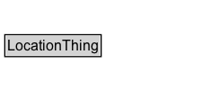

# LocationThing

Parent class for location domain concepts.

## Diagram

=== "SVG (interactive)"

    <!-- Generated by graphviz version 14.1.3 (20260303.0454)
     -->
    <!-- Pages: 1 -->
    <svg width="176pt" height="76pt"
     viewBox="0.00 0.00 176.00 76.00" xmlns="http://www.w3.org/2000/svg" xmlns:xlink="http://www.w3.org/1999/xlink">
    <g id="graph0" class="graph" transform="scale(1 1) rotate(0) translate(4 72)">
    <polygon fill="white" stroke="none" points="-4,4 -4,-72 172.25,-72 172.25,4 -4,4"/>
    <g id="clust3" class="cluster">
    <title>cluster_associated</title>
    </g>
    <!-- LocationThing -->
    <g id="node1" class="node">
    <title>LocationThing</title>
    <g id="a_node1"><a xlink:href="../LocationThing" xlink:title="&lt;TABLE&gt;">
    <polygon fill="lightgray" stroke="none" points="1,-25.88 1,-42.12 79.5,-42.12 79.5,-25.88 1,-25.88"/>
    <text xml:space="preserve" text-anchor="start" x="2" y="-29.88" font-family="Arial" font-size="12.00">LocationThing</text>
    <polygon fill="none" stroke="black" points="0,-24.88 0,-43.12 80.5,-43.12 80.5,-24.88 0,-24.88"/>
    </a>
    </g>
    </g>
    <!-- Invis -->
    </g>
    </svg>

=== "PNG"

    

## Specializations of LocationThing

| Class | Description |
|-------|-------------|
| [Area By Circle](AreaByCircle.md) | An area representation encoded as a circle. |
| [Area By Code](AreaByCode.md) | An area representation encoded as a code that references an entry in an external location referencing system. |
| [Area By Code](AreaByCode.md) | An area representation encoded as a code that references an entry in an external location referencing system. |
| [Area By Grid](AreaByGrid.md) | An area representation encoded as a grid. The rectangle defined by lower-left and upper-right is the base cell, which is replicated eastward (columns) and northward (rows). |
| [Area By Grid](AreaByGrid.md) | An area representation encoded as a grid. The rectangle defined by lower-left and upper-right is the base cell, which is replicated eastward (columns) and northward (rows). |
| [Area By Linear Boundaries](AreaByLinearBoundaries.md) | An area representation encoded as a set of linear boundary representations. |
| [Area By Multi Polygon](AreaByMultiPolygon.md) | An area representation encoded as a MultiPolygon geometry. |
| [Area By Polygon](AreaByPolygon.md) | An area representation encoded as a Polygon geometry. |
| [Area By Rectangle](AreaByRectangle.md) | An area representation encoded as a rectangle, defined by a lower-left corner and an upper-right corner. |
| [Area Location](AreaLocation.md) | A spatial location enclosed within a two-dimensional boundary or boundaries across a defined surface. |
| [Area Representation](AreaRepresentation.md) | A geometry/representation that encodes an area location using a specific method. |
| [Coordinate Geometry](CoordinateGeometry.md) | A geometry that is represented by a coordinate system (i.e., directly encodes coordinate tuples). |
| [Coordinate Reference System](CoordinateReferenceSystem.md) | A coordinate reference system (CRS) used to interpret coordinate tuples in a CoordinateGeometry. Typically identified using an OGC CRS IRI such as http://www.opengis.net/def/crs/EPSG/0/4326. |
| [Distance Accuracy](DistanceAccuracy.md) | A statement of distance accuracy for a point representation. |
| [Elevation](Elevation.md) | An elevation for a point location along with metadata. |
| [Elevation Accuracy](ElevationAccuracy.md) | A statement of elevation accuracy for a point representation. |
| [Elevation Height Code](ElevationHeightCode.md) | A code that identifies the height value for an elevation value  (e.g., 'ground layer 1', 'elevated layer 1', 'elevated layer 2', 'tunnel layer 1'). |
| [Elevation Reference Code](ElevationReferenceCode.md) | A code that identifies the reference system for an elevation value  (e.g., 'ellipsoidal', 'gravityRelated', 'ground level', 'EPSG:5701', 'coded height'). |
| [Feature](Feature.md) | An ITS-domain feature (subclass of geo:Feature) used to model real-world things that have a spatial location. |
| [Geometry](Geometry.md) | An ITS-domain geometry (subclass of geo:Geometry) used to model geometric representations of features. |
| [Itinerary](Itinerary.md) | An ordered set of multiple physically separate locations forming a route or itinerary. |
| [Itinerary By Waypoints](ItineraryByWaypoints.md) | An itinerary representation encoded as an ordered sequence of locations (waypoints). |
| [Itinerary Code](ItineraryCode.md) | An itinerary representation encoded as a code that references an entry in an external itinerary/route referencing system. |
| [Itinerary Representation](ItineraryRepresentation.md) | A geometry/representation that encodes an itinerary using a specific method. |
| [Linear By Code](LinearByCode.md) | A linear representation encoded as a code that references an entry in an external location referencing system. |
| [Linear By Code](LinearByCode.md) | A linear representation encoded as a code that references an entry in an external location referencing system. |
| [Linear By Linear Ring](LinearByLinearRing.md) | A linear representation encoded as a LinearRing geometry. |
| [Linear By Line String](LinearByLineString.md) | A linear representation encoded as a LineString geometry. |
| [Linear By Multi Line String](LinearByMultiLineString.md) | A linear representation encoded as a MultiLineString geometry. |
| [Linear By Point Representations](LinearByPointRepresentations.md) | A linear representation encoded as an ordered sequence of point representations. |
| [Linear By Points](LinearByPoints.md) | A linear representation encoded as an ordered sequence of points. |
| [Linear Location](LinearLocation.md) | spatial location that extends between two point locations along a defined path |
| [Linear Representation](LinearRepresentation.md) | A geometry/representation that encodes a linear location using a specific method. |
| [Location](Location.md) | A singular location modelled as a feature. |
| [Location Code](LocationCode.md) | A code that identifies (or can be used to look up) a location in some external referencing system. |
| [Location Group](LocationGroup.md) | An unordered set of multiple physically separate locations. |
| [Measurement Error Code](MeasurementErrorCode.md) | A code identifying an error condition or qualification for a measurement value. |
| [Offset Distance](OffsetDistance.md) | An offset distance expressed either as a length or as a percentage. |
| [Point By Code](PointByCode.md) | A point location representation using a code that references an entry in an external location referencing system. |
| [Point By Code](PointByCode.md) | A point location representation using a code that references an entry in an external location referencing system. |
| [Point By Coordinates](PointByCoordinates.md) | A point location representation encoded as coordinates and optional elements, such as elevation and metadata. |
| [Point By Coordinates](PointByCoordinates.md) | A point location representation encoded as coordinates and optional elements, such as elevation and metadata. |
| [Point By Geo Coordinates](PointByGeoCoordinates.md) | A point location representation encoded as latitude/longitude and optional elements, such as elevation and metadata. |
| [Point By Linear Position](PointByLinearPosition.md) | A point representation defined by an offset along a linear representation. |
| [Point By Projected Coordinates](PointByProjectedCoordinates.md) | A point location representation encoded as projected coordinates and optional elements, such as elevation and metadata. |
| [Point Location](PointLocation.md) | spatial location with no length in any of the spatial dimensions. |
| [Point Representation](PointRepresentation.md) | A representation of a point location using a specific method (e.g., coordinates or an external code). |
| [Position Accuracy](PositionAccuracy.md) | A statement of positional accuracy for a point representation. |
| [Position Confidence Ellipse](PositionConfidenceEllipse.md) | A confidence ellipse describing uncertainty of a point position in a horizontal plane. |
| [Spatial Object](SpatialObject.md) | A spatial object within the ITS domain (subclass of geo:SpatialObject). |

