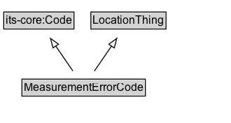

# MeasurementErrorCode

A code identifying an error condition or qualification for a measurement value.

## Diagram

=== "SVG (interactive)"

    <!-- Generated by graphviz version 14.1.3 (20260303.0454)
     -->
    <!-- Pages: 1 -->
    <svg width="248pt" height="132pt"
     viewBox="0.00 0.00 248.00 132.00" xmlns="http://www.w3.org/2000/svg" xmlns:xlink="http://www.w3.org/1999/xlink">
    <g id="graph0" class="graph" transform="scale(1 1) rotate(0) translate(4 128)">
    <polygon fill="white" stroke="none" points="-4,4 -4,-128 243.62,-128 243.62,4 -4,4"/>
    <g id="clust3" class="cluster">
    <title>cluster_associated</title>
    </g>
    <!-- its&#45;core_Code -->
    <g id="node1" class="node">
    <title>its&#45;core_Code</title>
    <g id="a_node1"><a xlink:href="https://w3id.org/itsdata/core/v1/Code" xlink:title="&lt;TABLE&gt;">
    <polygon fill="lightgray" stroke="none" points="1,-97.88 1,-114.12 74.25,-114.12 74.25,-97.88 1,-97.88"/>
    <text xml:space="preserve" text-anchor="start" x="2" y="-101.88" font-family="Arial" font-size="12.00">its&#45;core:Code</text>
    <polygon fill="none" stroke="black" points="0,-96.88 0,-115.12 75.25,-115.12 75.25,-96.88 0,-96.88"/>
    </a>
    </g>
    </g>
    <!-- LocationThing -->
    <g id="node2" class="node">
    <title>LocationThing</title>
    <g id="a_node2"><a xlink:href="../LocationThing" xlink:title="&lt;TABLE&gt;">
    <polygon fill="lightgray" stroke="none" points="94.38,-97.88 94.38,-114.12 172.88,-114.12 172.88,-97.88 94.38,-97.88"/>
    <text xml:space="preserve" text-anchor="start" x="95.38" y="-101.88" font-family="Arial" font-size="12.00">LocationThing</text>
    <polygon fill="none" stroke="black" points="93.38,-96.88 93.38,-115.12 173.88,-115.12 173.88,-96.88 93.38,-96.88"/>
    </a>
    </g>
    </g>
    <!-- MeasurementErrorCode -->
    <g id="node3" class="node">
    <title>MeasurementErrorCode</title>
    <g id="a_node3"><a xlink:href="../MeasurementErrorCode" xlink:title="&lt;TABLE&gt;">
    <polygon fill="lightgray" stroke="none" points="20.5,-25.88 20.5,-42.12 150.75,-42.12 150.75,-25.88 20.5,-25.88"/>
    <text xml:space="preserve" text-anchor="start" x="21.5" y="-29.88" font-family="Arial" font-size="12.00">MeasurementErrorCode</text>
    <polygon fill="none" stroke="black" points="19.5,-24.88 19.5,-43.12 151.75,-43.12 151.75,-24.88 19.5,-24.88"/>
    </a>
    </g>
    </g>
    <!-- MeasurementErrorCode&#45;&gt;its&#45;core_Code -->
    <g id="edge1" class="edge">
    <title>MeasurementErrorCode&#45;&gt;its&#45;core_Code</title>
    <path fill="none" stroke="black" d="M74.11,-51.79C68.59,-59.85 61.84,-69.69 55.65,-78.71"/>
    <polygon fill="none" stroke="black" points="52.87,-76.58 50.1,-86.81 58.64,-80.54 52.87,-76.58"/>
    </g>
    <!-- MeasurementErrorCode&#45;&gt;LocationThing -->
    <g id="edge2" class="edge">
    <title>MeasurementErrorCode&#45;&gt;LocationThing</title>
    <path fill="none" stroke="black" d="M97.14,-51.79C102.66,-59.85 109.41,-69.69 115.6,-78.71"/>
    <polygon fill="none" stroke="black" points="112.61,-80.54 121.15,-86.81 118.38,-76.58 112.61,-80.54"/>
    </g>
    <!-- Invis -->
    </g>
    </svg>

=== "PNG"

    

## Formalization for MeasurementErrorCode

| Property | Constraint |
|----------|------------|
| subClassOf | [its-core:Code](https://w3id.org/itsdata/core/v1/Code) |
| subClassOf | [LocationThing](LocationThing.md) |

