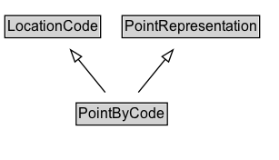

# PointByCode

A point location representation using a code that references an entry in an external location referencing system.

## Diagram

=== "SVG (interactive)"

    <!-- Generated by graphviz version 14.1.3 (20260303.0454)
     -->
    <!-- Pages: 1 -->
    <svg width="231pt" height="132pt"
     viewBox="0.00 0.00 231.00 132.00" xmlns="http://www.w3.org/2000/svg" xmlns:xlink="http://www.w3.org/1999/xlink">
    <g id="graph0" class="graph" transform="scale(1 1) rotate(0) translate(4 128)">
    <polygon fill="white" stroke="none" points="-4,4 -4,-128 226.5,-128 226.5,4 -4,4"/>
    <g id="clust3" class="cluster">
    <title>cluster_associated</title>
    </g>
    <!-- LocationCode -->
    <g id="node1" class="node">
    <title>LocationCode</title>
    <g id="a_node1"><a xlink:href="../LocationCode" xlink:title="&lt;TABLE&gt;">
    <polygon fill="lightgray" stroke="none" points="1,-97.88 1,-114.12 78,-114.12 78,-97.88 1,-97.88"/>
    <text xml:space="preserve" text-anchor="start" x="2" y="-101.88" font-family="Arial" font-size="12.00">LocationCode</text>
    <polygon fill="none" stroke="black" points="0,-96.88 0,-115.12 79,-115.12 79,-96.88 0,-96.88"/>
    </a>
    </g>
    </g>
    <!-- PointRepresentation -->
    <g id="node2" class="node">
    <title>PointRepresentation</title>
    <g id="a_node2"><a xlink:href="../PointRepresentation" xlink:title="&lt;TABLE&gt;">
    <polygon fill="lightgray" stroke="none" points="97.75,-97.88 97.75,-114.12 209.25,-114.12 209.25,-97.88 97.75,-97.88"/>
    <text xml:space="preserve" text-anchor="start" x="98.75" y="-101.88" font-family="Arial" font-size="12.00">PointRepresentation</text>
    <polygon fill="none" stroke="black" points="96.75,-96.88 96.75,-115.12 210.25,-115.12 210.25,-96.88 96.75,-96.88"/>
    </a>
    </g>
    </g>
    <!-- PointByCode -->
    <g id="node3" class="node">
    <title>PointByCode</title>
    <g id="a_node3"><a xlink:href="../PointByCode" xlink:title="&lt;TABLE&gt;">
    <polygon fill="lightgray" stroke="none" points="59.88,-25.88 59.88,-42.12 133.12,-42.12 133.12,-25.88 59.88,-25.88"/>
    <text xml:space="preserve" text-anchor="start" x="60.88" y="-29.88" font-family="Arial" font-size="12.00">PointByCode</text>
    <polygon fill="none" stroke="black" points="58.88,-24.88 58.88,-43.12 134.12,-43.12 134.12,-24.88 58.88,-24.88"/>
    </a>
    </g>
    </g>
    <!-- PointByCode&#45;&gt;LocationCode -->
    <g id="edge1" class="edge">
    <title>PointByCode&#45;&gt;LocationCode</title>
    <path fill="none" stroke="black" d="M82.83,-51.79C76.13,-60.02 67.91,-70.11 60.44,-79.29"/>
    <polygon fill="none" stroke="black" points="57.85,-76.92 54.25,-86.88 63.28,-81.34 57.85,-76.92"/>
    </g>
    <!-- PointByCode&#45;&gt;PointRepresentation -->
    <g id="edge2" class="edge">
    <title>PointByCode&#45;&gt;PointRepresentation</title>
    <path fill="none" stroke="black" d="M110.17,-51.79C116.87,-60.02 125.09,-70.11 132.56,-79.29"/>
    <polygon fill="none" stroke="black" points="129.72,-81.34 138.75,-86.88 135.15,-76.92 129.72,-81.34"/>
    </g>
    <!-- Invis -->
    </g>
    </svg>

=== "PNG"

    

## Formalization for PointByCode

| Property | Constraint |
|----------|------------|
| subClassOf | [PointRepresentation](PointRepresentation.md) |
| subClassOf | [LocationCode](LocationCode.md) |

