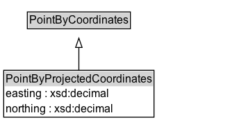

# PointByProjectedCoordinates

A point location representation encoded as projected coordinates and optional elements, such as elevation and metadata.

## Diagram

=== "SVG (interactive)"

    <!-- Generated by graphviz version 14.1.3 (20260303.0454)
     -->
    <!-- Pages: 1 -->
    <svg width="258pt" height="139pt"
     viewBox="0.00 0.00 258.00 139.00" xmlns="http://www.w3.org/2000/svg" xmlns:xlink="http://www.w3.org/1999/xlink">
    <g id="graph0" class="graph" transform="scale(1 1) rotate(0) translate(4 135.38)">
    <polygon fill="white" stroke="none" points="-4,4 -4,-135.38 254.12,-135.38 254.12,4 -4,4"/>
    <g id="clust3" class="cluster">
    <title>cluster_associated</title>
    </g>
    <!-- PointByCoordinates -->
    <g id="node1" class="node">
    <title>PointByCoordinates</title>
    <g id="a_node1"><a xlink:href="../PointByCoordinates" xlink:title="&lt;TABLE&gt;">
    <polygon fill="lightgray" stroke="none" points="26.5,-105.25 26.5,-121.5 135.75,-121.5 135.75,-105.25 26.5,-105.25"/>
    <text xml:space="preserve" text-anchor="start" x="27.5" y="-109.25" font-family="Arial" font-size="12.00">PointByCoordinates</text>
    <polygon fill="none" stroke="black" points="25.5,-104.25 25.5,-122.5 136.75,-122.5 136.75,-104.25 25.5,-104.25"/>
    </a>
    </g>
    </g>
    <!-- PointByProjectedCoordinates -->
    <g id="node2" class="node">
    <title>PointByProjectedCoordinates</title>
    <g id="a_node2"><a xlink:href="../PointByProjectedCoordinates" xlink:title="&lt;TABLE&gt;">
    <polygon fill="lightgray" stroke="none" points="1,-42.12 1,-58.38 161.25,-58.38 161.25,-42.12 1,-42.12"/>
    <text xml:space="preserve" text-anchor="start" x="2" y="-46.12" font-family="Arial" font-size="12.00">PointByProjectedCoordinates</text>
    <text xml:space="preserve" text-anchor="start" x="2" y="-29.88" font-family="Arial" font-size="12.00">easting : xsd:decimal</text>
    <text xml:space="preserve" text-anchor="start" x="2" y="-13.62" font-family="Arial" font-size="12.00">northing : xsd:decimal</text>
    <polygon fill="none" stroke="black" points="0,-8.62 0,-59.38 162.25,-59.38 162.25,-8.62 0,-8.62"/>
    </a>
    </g>
    </g>
    <!-- PointByProjectedCoordinates&#45;&gt;PointByCoordinates -->
    <g id="edge1" class="edge">
    <title>PointByProjectedCoordinates&#45;&gt;PointByCoordinates</title>
    <path fill="none" stroke="black" d="M81.12,-59.1C81.12,-67.05 81.12,-75.97 81.12,-84.21"/>
    <polygon fill="none" stroke="black" points="77.63,-84.07 81.13,-94.07 84.63,-84.07 77.63,-84.07"/>
    </g>
    <!-- Invis -->
    </g>
    </svg>

=== "PNG"

    

## Formalization for PointByProjectedCoordinates

| Property | Constraint |
|----------|------------|
| [easting](properties/easting.md) | datatype xsd:decimal |
| [northing](properties/northing.md) | datatype xsd:decimal |
| subClassOf | [PointByCoordinates](PointByCoordinates.md) |

