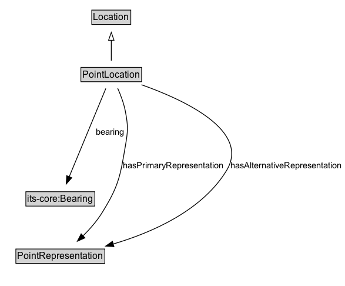

# PointLocation

spatial location with no length in any of the spatial dimensions.

## Diagram

=== "SVG (interactive)"

    <!-- Generated by graphviz version 14.1.3 (20260303.0454)
     -->
    <!-- Pages: 1 -->
    <svg width="440pt" height="365pt"
     viewBox="0.00 0.00 440.00 365.00" xmlns="http://www.w3.org/2000/svg" xmlns:xlink="http://www.w3.org/1999/xlink">
    <g id="graph0" class="graph" transform="scale(1 1) rotate(0) translate(4 360.5)">
    <polygon fill="white" stroke="none" points="-4,4 -4,-360.5 436.35,-360.5 436.35,4 -4,4"/>
    <g id="clust3" class="cluster">
    <title>cluster_associated</title>
    </g>
    <!-- Location -->
    <g id="node1" class="node">
    <title>Location</title>
    <g id="a_node1"><a xlink:href="../Location" xlink:title="&lt;TABLE&gt;">
    <polygon fill="lightgray" stroke="none" points="114.12,-330.38 114.12,-346.62 161.88,-346.62 161.88,-330.38 114.12,-330.38"/>
    <text xml:space="preserve" text-anchor="start" x="115.12" y="-334.38" font-family="Arial" font-size="12.00">Location</text>
    <polygon fill="none" stroke="black" points="113.12,-329.38 113.12,-347.62 162.88,-347.62 162.88,-329.38 113.12,-329.38"/>
    </a>
    </g>
    </g>
    <!-- PointLocation -->
    <g id="node2" class="node">
    <title>PointLocation</title>
    <g id="a_node2"><a xlink:href="../PointLocation" xlink:title="&lt;TABLE&gt;">
    <polygon fill="lightgray" stroke="none" points="100.25,-257.38 100.25,-273.62 175.75,-273.62 175.75,-257.38 100.25,-257.38"/>
    <text xml:space="preserve" text-anchor="start" x="101.25" y="-261.38" font-family="Arial" font-size="12.00">PointLocation</text>
    <polygon fill="none" stroke="black" points="99.25,-256.38 99.25,-274.62 176.75,-274.62 176.75,-256.38 99.25,-256.38"/>
    </a>
    </g>
    </g>
    <!-- PointLocation&#45;&gt;Location -->
    <g id="edge1" class="edge">
    <title>PointLocation&#45;&gt;Location</title>
    <path fill="none" stroke="black" d="M138,-283.21C138,-290.97 138,-300.42 138,-309.24"/>
    <polygon fill="none" stroke="black" points="134.5,-309.16 138,-319.16 141.5,-309.16 134.5,-309.16"/>
    </g>
    <!-- Invis -->
    <!-- PointLocation&#45;&gt;Invis -->
    <!-- its&#45;core_Bearing -->
    <g id="node4" class="node">
    <title>its&#45;core_Bearing</title>
    <g id="a_node4"><a xlink:href="https://w3id.org/itsdata/core/v1/Bearing" xlink:title="&lt;TABLE&gt;">
    <polygon fill="lightgray" stroke="none" points="30,-98.88 30,-115.12 116,-115.12 116,-98.88 30,-98.88"/>
    <text xml:space="preserve" text-anchor="start" x="31" y="-102.88" font-family="Arial" font-size="12.00">its&#45;core:Bearing</text>
    <polygon fill="none" stroke="black" points="29,-97.88 29,-116.12 117,-116.12 117,-97.88 29,-97.88"/>
    </a>
    </g>
    </g>
    <!-- PointLocation&#45;&gt;its&#45;core_Bearing -->
    <g id="edge5" class="edge">
    <title>PointLocation&#45;&gt;its&#45;core_Bearing</title>
    <path fill="none" stroke="black" d="M131.04,-247.75C119.85,-220.81 97.75,-167.58 84.28,-135.15"/>
    <polygon fill="black" stroke="black" points="87.55,-133.92 80.49,-126.03 81.09,-136.6 87.55,-133.92"/>
    <text xml:space="preserve" text-anchor="middle" x="136.69" y="-188.8" font-family="Arial" font-size="11.00">bearing</text>
    </g>
    <!-- PointRepresentation -->
    <g id="node5" class="node">
    <title>PointRepresentation</title>
    <g id="a_node5"><a xlink:href="../PointRepresentation" xlink:title="&lt;TABLE&gt;">
    <polygon fill="lightgray" stroke="none" points="17.25,-25.88 17.25,-42.12 128.75,-42.12 128.75,-25.88 17.25,-25.88"/>
    <text xml:space="preserve" text-anchor="start" x="18.25" y="-29.88" font-family="Arial" font-size="12.00">PointRepresentation</text>
    <polygon fill="none" stroke="black" points="16.25,-24.88 16.25,-43.12 129.75,-43.12 129.75,-24.88 16.25,-24.88"/>
    </a>
    </g>
    </g>
    <!-- PointLocation&#45;&gt;PointRepresentation -->
    <g id="edge6" class="edge">
    <title>PointLocation&#45;&gt;PointRepresentation</title>
    <path fill="none" stroke="black" d="M146.23,-247.91C150.02,-239.35 154.09,-228.61 156,-218.5 159.63,-199.28 159.28,-193.78 156,-174.5 149.24,-134.8 147.28,-123.19 126,-89 119.42,-78.44 110.46,-68.3 101.77,-59.71"/>
    <polygon fill="black" stroke="black" points="104.38,-57.37 94.71,-53.04 99.57,-62.45 104.38,-57.37"/>
    <text xml:space="preserve" text-anchor="middle" x="216.85" y="-146.05" font-family="Arial" font-size="11.00">hasPrimaryRepresentation</text>
    </g>
    <!-- PointLocation&#45;&gt;PointRepresentation -->
    <g id="edge7" class="edge">
    <title>PointLocation&#45;&gt;PointRepresentation</title>
    <path fill="none" stroke="black" d="M176.52,-252.48C229.86,-233.68 316.31,-194.1 285,-143 253.7,-91.92 189.82,-64.06 140.32,-49.49"/>
    <polygon fill="black" stroke="black" points="141.39,-46.16 130.82,-46.82 139.5,-52.9 141.39,-46.16"/>
    <text xml:space="preserve" text-anchor="middle" x="361.47" y="-146.05" font-family="Arial" font-size="11.00">hasAlternativeRepresentation</text>
    </g>
    <!-- Invis&#45;&gt;its&#45;core_Bearing -->
    <!-- its&#45;core_Bearing&#45;&gt;PointRepresentation -->
    </g>
    </svg>

=== "PNG"

    

## Formalization for PointLocation

| Property | Constraint |
|----------|------------|
| [bearing](properties/bearing.md) | only [its-core:Bearing](https://w3id.org/itsdata/core/v1/Bearing) |
| [hasAlternativeRepresentation](properties/hasAlternativeRepresentation.md) | only [PointRepresentation](https://w3id.org/itsdata/location/v1/PointRepresentation) |
| [hasPrimaryRepresentation](properties/hasPrimaryRepresentation.md) | only [PointRepresentation](https://w3id.org/itsdata/location/v1/PointRepresentation) |
| subClassOf | [Location](Location.md) |

