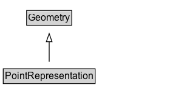

# PointRepresentation

A representation of a point location using a specific method (e.g., coordinates or an external code).

## Diagram

=== "SVG (interactive)"

    <!-- Generated by graphviz version 14.1.3 (20260303.0454)
     -->
    <!-- Pages: 1 -->
    <svg width="210pt" height="132pt"
     viewBox="0.00 0.00 210.00 132.00" xmlns="http://www.w3.org/2000/svg" xmlns:xlink="http://www.w3.org/1999/xlink">
    <g id="graph0" class="graph" transform="scale(1 1) rotate(0) translate(4 128)">
    <polygon fill="white" stroke="none" points="-4,4 -4,-128 205.75,-128 205.75,4 -4,4"/>
    <g id="clust3" class="cluster">
    <title>cluster_associated</title>
    </g>
    <!-- Geometry -->
    <g id="node1" class="node">
    <title>Geometry</title>
    <g id="a_node1"><a xlink:href="../Geometry" xlink:title="&lt;TABLE&gt;">
    <polygon fill="lightgray" stroke="none" points="29.88,-97.88 29.88,-114.12 83.62,-114.12 83.62,-97.88 29.88,-97.88"/>
    <text xml:space="preserve" text-anchor="start" x="30.88" y="-101.88" font-family="Arial" font-size="12.00">Geometry</text>
    <polygon fill="none" stroke="black" points="28.88,-96.88 28.88,-115.12 84.62,-115.12 84.62,-96.88 28.88,-96.88"/>
    </a>
    </g>
    </g>
    <!-- PointRepresentation -->
    <g id="node2" class="node">
    <title>PointRepresentation</title>
    <g id="a_node2"><a xlink:href="../PointRepresentation" xlink:title="&lt;TABLE&gt;">
    <polygon fill="lightgray" stroke="none" points="1,-25.88 1,-42.12 112.5,-42.12 112.5,-25.88 1,-25.88"/>
    <text xml:space="preserve" text-anchor="start" x="2" y="-29.88" font-family="Arial" font-size="12.00">PointRepresentation</text>
    <polygon fill="none" stroke="black" points="0,-24.88 0,-43.12 113.5,-43.12 113.5,-24.88 0,-24.88"/>
    </a>
    </g>
    </g>
    <!-- PointRepresentation&#45;&gt;Geometry -->
    <g id="edge1" class="edge">
    <title>PointRepresentation&#45;&gt;Geometry</title>
    <path fill="none" stroke="black" d="M56.75,-51.79C56.75,-59.25 56.75,-68.24 56.75,-76.69"/>
    <polygon fill="none" stroke="black" points="53.25,-76.54 56.75,-86.54 60.25,-76.54 53.25,-76.54"/>
    </g>
    <!-- Invis -->
    </g>
    </svg>

=== "PNG"

    

## Specializations of PointRepresentation

| Class | Description |
|-------|-------------|
| [Point By Code](PointByCode.md) | A point location representation using a code that references an entry in an external location referencing system. |
| [Point By Coordinates](PointByCoordinates.md) | A point location representation encoded as coordinates and optional elements, such as elevation and metadata. |
| [Point By Geo Coordinates](PointByGeoCoordinates.md) | A point location representation encoded as latitude/longitude and optional elements, such as elevation and metadata. |
| [Point By Linear Position](PointByLinearPosition.md) | A point representation defined by an offset along a linear representation. |
| [Point By Projected Coordinates](PointByProjectedCoordinates.md) | A point location representation encoded as projected coordinates and optional elements, such as elevation and metadata. |

## Formalization for PointRepresentation

| Property | Constraint |
|----------|------------|
| subClassOf | [Geometry](Geometry.md) |

