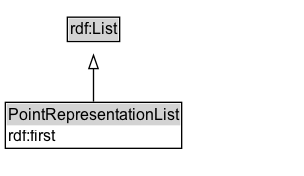

# PointRepresentationList

An ordered list of member point representations.

## Diagram

=== "SVG (interactive)"

    <!-- Generated by graphviz version 14.1.3 (20260303.0454)
     -->
    <!-- Pages: 1 -->
    <svg width="228pt" height="132pt"
     viewBox="0.00 0.00 228.00 132.00" xmlns="http://www.w3.org/2000/svg" xmlns:xlink="http://www.w3.org/1999/xlink">
    <g id="graph0" class="graph" transform="scale(1 1) rotate(0) translate(4 128)">
    <polygon fill="white" stroke="none" points="-4,4 -4,-128 224.12,-128 224.12,4 -4,4"/>
    <g id="clust3" class="cluster">
    <title>cluster_associated</title>
    </g>
    <!-- rdf_List -->
    <g id="node1" class="node">
    <title>rdf_List</title>
    <g id="a_node1"><a xlink:href="https://w3id.org/citydata/imported/rdf/latest/List" xlink:title="&lt;TABLE&gt;">
    <polygon fill="lightgray" stroke="none" points="47.5,-97.88 47.5,-114.12 84.75,-114.12 84.75,-97.88 47.5,-97.88"/>
    <text xml:space="preserve" text-anchor="start" x="48.5" y="-101.88" font-family="Arial" font-size="12.00">rdf:List</text>
    <polygon fill="none" stroke="black" points="46.5,-96.88 46.5,-115.12 85.75,-115.12 85.75,-96.88 46.5,-96.88"/>
    </a>
    </g>
    </g>
    <!-- PointRepresentationList -->
    <g id="node2" class="node">
    <title>PointRepresentationList</title>
    <g id="a_node2"><a xlink:href="../PointRepresentationList" xlink:title="&lt;TABLE&gt;">
    <polygon fill="lightgray" stroke="none" points="1,-34 1,-50.25 131.25,-50.25 131.25,-34 1,-34"/>
    <text xml:space="preserve" text-anchor="start" x="2" y="-38" font-family="Arial" font-size="12.00">PointRepresentationList</text>
    <text xml:space="preserve" text-anchor="start" x="2" y="-21.75" font-family="Arial" font-size="12.00">rdf:first</text>
    <polygon fill="none" stroke="black" points="0,-16.75 0,-51.25 132.25,-51.25 132.25,-16.75 0,-16.75"/>
    </a>
    </g>
    </g>
    <!-- PointRepresentationList&#45;&gt;rdf_List -->
    <g id="edge1" class="edge">
    <title>PointRepresentationList&#45;&gt;rdf_List</title>
    <path fill="none" stroke="black" d="M66.12,-51.79C66.12,-59.25 66.12,-68.24 66.12,-76.69"/>
    <polygon fill="none" stroke="black" points="62.63,-76.54 66.13,-86.54 69.63,-76.54 62.63,-76.54"/>
    </g>
    <!-- Invis -->
    </g>
    </svg>

=== "PNG"

    

## Formalization for PointRepresentationList

| Property | Constraint |
|----------|------------|
| [rdf:first](https://w3id.org/citydata/imported/rdf/first) | only [PointRepresentation](https://w3id.org/itsdata/location/v1/PointRepresentation) |
| subClassOf | [rdf:List](https://w3id.org/citydata/imported/rdf/List) |

