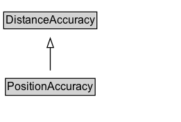

# PositionAccuracy

A statement of positional accuracy for a point representation.

## Diagram

=== "SVG (interactive)"

    <!-- Generated by graphviz version 14.1.3 (20260303.0454)
     -->
    <!-- Pages: 1 -->
    <svg width="195pt" height="132pt"
     viewBox="0.00 0.00 195.00 132.00" xmlns="http://www.w3.org/2000/svg" xmlns:xlink="http://www.w3.org/1999/xlink">
    <g id="graph0" class="graph" transform="scale(1 1) rotate(0) translate(4 128)">
    <polygon fill="white" stroke="none" points="-4,4 -4,-128 191.38,-128 191.38,4 -4,4"/>
    <g id="clust3" class="cluster">
    <title>cluster_associated</title>
    </g>
    <!-- DistanceAccuracy -->
    <g id="node1" class="node">
    <title>DistanceAccuracy</title>
    <g id="a_node1"><a xlink:href="../DistanceAccuracy" xlink:title="&lt;TABLE&gt;">
    <polygon fill="lightgray" stroke="none" points="1,-97.88 1,-114.12 99.75,-114.12 99.75,-97.88 1,-97.88"/>
    <text xml:space="preserve" text-anchor="start" x="2" y="-101.88" font-family="Arial" font-size="12.00">DistanceAccuracy</text>
    <polygon fill="none" stroke="black" points="0,-96.88 0,-115.12 100.75,-115.12 100.75,-96.88 0,-96.88"/>
    </a>
    </g>
    </g>
    <!-- PositionAccuracy -->
    <g id="node2" class="node">
    <title>PositionAccuracy</title>
    <g id="a_node2"><a xlink:href="../PositionAccuracy" xlink:title="&lt;TABLE&gt;">
    <polygon fill="lightgray" stroke="none" points="2.88,-25.88 2.88,-42.12 97.88,-42.12 97.88,-25.88 2.88,-25.88"/>
    <text xml:space="preserve" text-anchor="start" x="3.88" y="-29.88" font-family="Arial" font-size="12.00">PositionAccuracy</text>
    <polygon fill="none" stroke="black" points="1.88,-24.88 1.88,-43.12 98.88,-43.12 98.88,-24.88 1.88,-24.88"/>
    </a>
    </g>
    </g>
    <!-- PositionAccuracy&#45;&gt;DistanceAccuracy -->
    <g id="edge1" class="edge">
    <title>PositionAccuracy&#45;&gt;DistanceAccuracy</title>
    <path fill="none" stroke="black" d="M50.38,-51.79C50.38,-59.25 50.38,-68.24 50.38,-76.69"/>
    <polygon fill="none" stroke="black" points="46.88,-76.54 50.38,-86.54 53.88,-76.54 46.88,-76.54"/>
    </g>
    <!-- Invis -->
    </g>
    </svg>

=== "PNG"

    

## Formalization for PositionAccuracy

| Property | Constraint |
|----------|------------|
| subClassOf | [DistanceAccuracy](DistanceAccuracy.md) |

